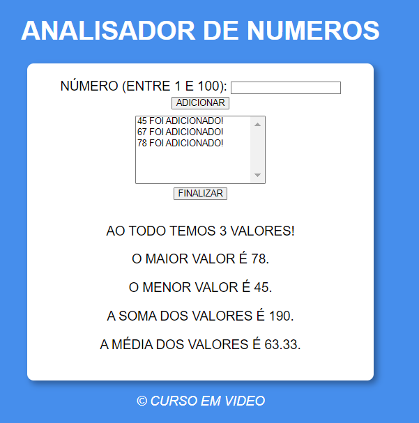

# ANALISADOR DE NUMEROS
👨‍🏫PROJETO FEITO PARA O CURSO DE JAVASCRIPT DO CURSO EM VIDEO.

 <br>

## DESCRIÇÃO:
O "ANALISADOR DE NÚMEROS" é uma aplicação simples que permite aos usuários adicionar números entre 1 e 100 e analisar esses números. Aqui estão as principais funcionalidades implementadas:

1. **Adicionar Números:**
   - Os usuários podem inserir números entre 1 e 100 em um campo de entrada e adicioná-los à lista clicando no botão "ADICIONAR".
   - Se o número for válido e não estiver repetido na lista, ele será adicionado.

2. **Finalizar Análise:**
   - Ao clicar no botão "FINALIZAR", a aplicação analisará os números adicionados.
   - Será exibido o total de números adicionados, o maior valor, o menor valor, a soma de todos os valores e a média dos valores.

## COMO USAR?
### BAIXANDO O PROJETO:
* Clone o repositório para o seu sistema local:

```bash
git clone https://github.com/VILHALVA/ANALISADOR-DE-NUMEROS.git
```

* Navegue até o diretório do projeto.

```bash
cd ANALISADOR-DE-NUMEROS
```

* Descompacte o arquivo ZIP (se você baixou manualmente):

```bash
unzip ANALISADOR-DE-NUMEROS.zip
```
* Abra o arquivo `CODIGO.html` em seu navegador de preferência.

### EXECUTANDO O PROJETO:
1. **Adicionar Números:**
   - Insira um número entre 1 e 100 no campo de entrada.
   - Clique em "ADICIONAR" para adicionar o número à lista.

2. **Finalizar Análise:**
   - Após adicionar os números desejados, clique em "FINALIZAR" para realizar a análise.
   - Serão exibidas informações sobre os números adicionados, incluindo o total, o maior valor, o menor valor, a soma e a média.

## NÃO SABE?
- Entendemos que para manipular arquivos em `HTML`, `CSS` e outras linguagens relacionadas, é necessário possuir conhecimento nessas áreas. Para auxiliar nesse aprendizado, oferecemos cursos gratuitos disponíveis:
* [Curso de HTML e CSS](https://github.com/VILHALVA/CURSO-DE-HTML-E-CSS)
* [Curso de JavaScript](https://github.com/VILHALVA/CURSO-DE-JAVASCRIPT)
* [Confira mais cursos](https://github.com/VILHALVA?tab=repositories&q=+topic:CURSO)

## CREDITOS:
- [PROJETO FEITO PELO VILHALVA](https://github.com/VILHALVA)
- [PROJETO FEITO PARA O CURSO DE JAVASCRIPT](https://github.com/VILHALVA/CURSO-DE-JAVASCRIPT)
- [ESTÁ DISPONIVEL NO SITE](https://vilhalva.github.io/STYLER/STYLER.html)
